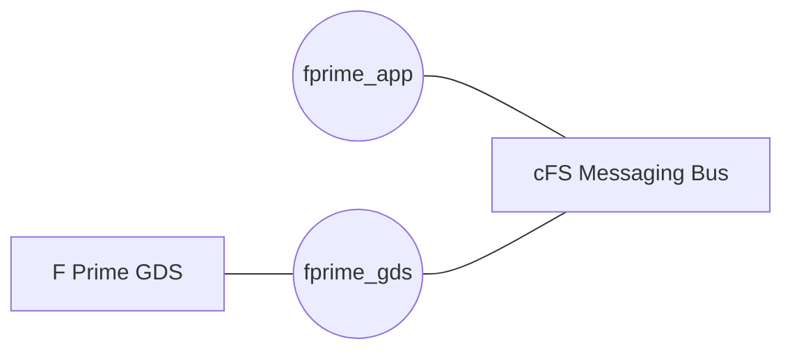

# fprime_cfs_reference: A cFS System Using F Prime cFS Applications

This repository contains a minimal cFS system that demonstrates the use of cFS applications built with F Prime. This demonstration includes the following two applications:

1. `fprime_app`: A simple demonstration app showing how to construct cFS applications using F Prime
2. `fprime_gds`: An application that bridges the F Prime GDS to the cFS messaging bus




## Setup

Clone the repository and initialize the submodules:

```bash
git clone --recurse-submodules https://github.com/fprime-community/fprime_cfs_reference.git
```

Set up the python virtual environment and install the required dependencies:

```bash
python3 -m venv fprime-venv
source fprime-venv/bin/activate
pip install -r requirements.txt
```

You should be ready to prepare and build the reference system.

> [!TIP]
> Always activate the virtual environment using `source fprime-venv/bin/activate` before running any of the following commands.

## Building the Reference

This reference is built using the standard cFS build system. The first step is to prepare the build:

```bash
make SIMULATION=native prep
```

Once this build is prepared, build and install the reference system:

```bash
make
make install
```

## Running the Reference

> [!IMPORTANT]
> The F Prime application's rate groups (command dispatch, telemetry send, health, com queue) are
> driven by cFS scheduler (SCH) tick messages on APID `0x0090`. A SCH application publishing these
> ticks at 1 Hz must be part of the cFS build; without it, no telemetry is downlinked and the
> integration tests will fail. See [PR #9](https://github.com/fprime-community/fprime_cfs_reference/pull/9)
> which adds this SCH app.

The build is installed in `build-artifacts/exe/cpu1/`. You can run the reference system using the following command:

```bash
cd build-artifacts/exe/cpu1/
./core-cpu1
```

## Running the F Prime GDS

The reference hosts a TCP server for the GDS to connect on port `15010`. The GDS can be run with:

```bash
fprime-gds --ip-port 15010 --dictionary ./build-artifacts/exe/Linux/fprime_app/dict/*Dictionary.json  -n --ip-client
```

Enjoy!
