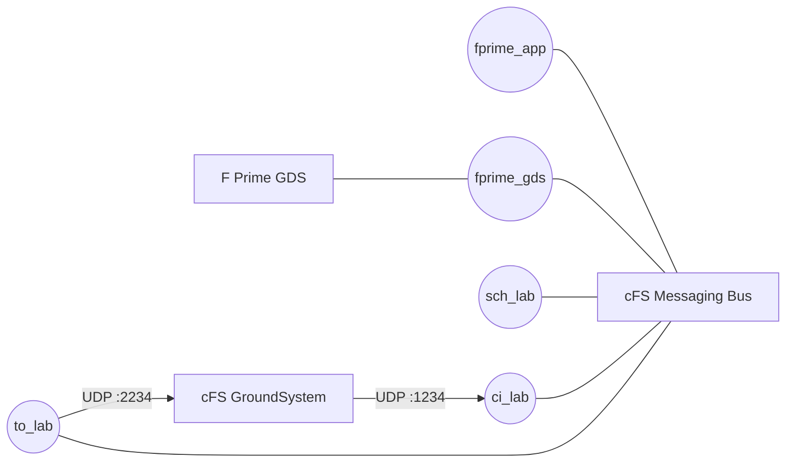

# fprime_cfs_reference: A cFS System Using F Prime cFS Applications

This repository contains a minimal cFS system that demonstrates the use of cFS applications built with F Prime. This demonstration includes the following two applications:

1. `fprime_app`: A simple demonstration app showing how to construct cFS applications using F Prime
2. `fprime_gds`: An application that bridges the F Prime GDS to the cFS messaging bus

The system also includes the standard cFS lab apps:

- `sch_lab`: publishes the 1 Hz tick that drives the F Prime application's rate groups
- `ci_lab`: command ingest, receiving cFS command packets over UDP (port `1234`)
- `to_lab`: telemetry output, forwarding subscribed software bus telemetry over UDP (port `2234`)

`ci_lab` and `to_lab` give the [cFS GroundSystem](https://github.com/nasa/cFS-GroundSystem)
a direct path to the software bus; `to_lab` is subscribed to the F Prime packetized
telemetry message (`0x0820`) in `fprime_cfs_reference_defs/tables/cpu1_to_lab_sub.c`.



## Setup

Clone the repository and initialize the submodules:

```bash
git clone --recurse-submodules https://github.com/fprime-community/fprime_cfs_reference.git
```

Set up the python virtual environment and install the required dependencies:

```bash
python3 -m venv fprime-venv
source fprime-venv/bin/activate
pip install -r requirements.txt
```

You should be ready to prepare and build the reference system.

> [!TIP]
> Always activate the virtual environment using `source fprime-venv/bin/activate` before running any of the following commands.

## Building the Reference

This reference is built using the standard cFS build system. The first step is to prepare the build:

```bash
make SIMULATION=native prep
```

Once this build is prepared, build and install the reference system:

```bash
make
make install
```

## Running the Reference

> [!NOTE]
> The F Prime application's rate groups are driven by a 1 Hz tick message (command MID `0x1890`,
> APID `0x090`) published by the `sch_lab` scheduler app included in this system. The schedule is
> configured in `fprime_cfs_reference_defs/tables/cpu1_sch_lab_table.c`.

The build is installed in `build-artifacts/exe/cpu1/`. You can run the reference system using the following command:

```bash
cd build-artifacts/exe/cpu1/
./core-cpu1
```

## Running the F Prime GDS

The reference hosts a TCP server for the GDS to connect on port `15010`. The GDS can be run with:

```bash
fprime-gds --ip-port 15010 --dictionary ./build-artifacts/exe/Linux/fprime_app/dict/*Dictionary.json  -n --ip-client
```

## Running the cFS GroundSystem

The cFS GroundSystem can command and monitor the system directly through `ci_lab` and
`to_lab` using the `fprime-cfs` tooling from the
[fprime_cfs](https://github.com/fprime-community/fprime_cfs) library:

```bash
fprime-cfs --dictionary ./build-artifacts/exe/Linux/fprime_app/dict/*Dictionary.json \
    --ground-system-dir tools/cFS-GroundSystem \
    --deployment build-artifacts/exe/cpu1 --app build-artifacts/exe/cpu1/core-cpu1
```

Enjoy!
